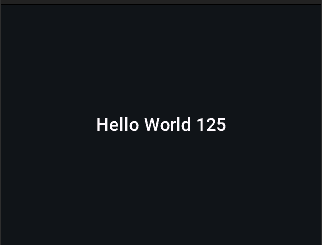

# Hello World

This is a straightforward application that renders simple text on the screen and demonstrates the basic method of creating interactive applications using the LVGL graphics library.

Discover more on the
[Mini Dock Developer Website](https://dock.myvobot.com/developer/).
