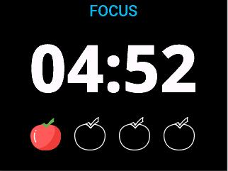

# Pomodoro Timer

The Pomodoro Timer app is designed to help users improve work efficiency by combining focused work sessions with short breaks, thereby promoting better time management. The app offers three modes: Focus Mode, Short Break Mode, and Long Break Mode.

### Mode Descriptions

1. Focus Mode (MODE_FOCUS)
    - Default Duration: 25 minutes
    - This mode is used for concentrating on tasks and completing work.
    - When switching to this mode, the screen and buzzer will provide a notification.

2. Short Break Mode (MODE_SHORT_BREAK)
    - Default Duration: 5 minutes
    - This mode is designed for short breaks to help users relieve fatigue.
    - When switching to this mode, the screen and buzzer will provide a notification.

3. Long Break Mode (MODE_LONG_BREAK)
    - Default Duration: 30 minutes
    - This mode is intended for longer breaks, suitable for use after completing multiple focus sessions.
    - When switching to this mode, the screen and buzzer will provide a notification.

### Configuration Options

Users can customize the duration of each mode in the app's settings to fit their work habits and preferences.

### Re-Entry Prompt

If users exit the app while a countdown is still running, they will receive a prompt upon re-entering the app, asking whether they would like to continue the previous countdown.

Discover more on the
[Mini Dock Developer Website](https://dock.myvobot.com/developer/).
