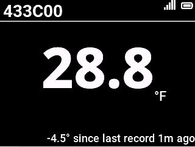

# Sensor App

## Introduction

Sensor App is an application for viewing measurement information from specified product Bluetooth sensors. Users can view the current measurement data of the sensor in real time, and some sensors also support querying historical measurement data. In addition, the app provides detailed information display of Bluetooth sensors, making it convenient for users to fully understand and manage sensor devices.

## Main Features

- **Real-time Measurement Information**  
  Supports viewing the current measurement data of Bluetooth sensors.

- **Historical Data Query**  
  Some sensors support viewing recent measurement history records.

- **Sensor Details**  
  View detailed information of Bluetooth sensors, including device parameters, etc.

## Directory Structure

```bash
sensor_app/
├── asset/ # For storing resource files, such as .html files
├── bluetooth/ # Bluetooth scanning module
├── demo/ # Sensor simulation programs
├── product/ # Modules for different products
├── ui_page/ # UI page generation and switching module
├── `__init__.py` # App entry point
├── `base.py` # Main process handling module
├── `routes.py` # Route configuration and corresponding functions
```

## product Directory Description

The `product` directory contains modules for different products. Each product module should implement the logic for data processing and display.
The `product/virtual_sensor` directory contains modules for virtual sensors, used to simulate sensor measurement data. The corresponding virtual sensor example program is `demo/ble_advertiser.py`.

## How to Add a New Product Module

1. Add a new product module under the `product` directory, such as `product/new_product`.
2. The new module should implement the following functions:
    - `get_product_name`: Returns the product name
    - `get_gap_name_callbacks`: Returns the GAP name corresponding to the product and the corresponding broadcast processing function
    - `get_profile`: Returns the profile corresponding to the product
    - `get_sensor_data`: Returns the real-time data of the corresponding sensor
    - `delete_sensor_data`: Deletes the sensor information and data corresponding to the product
    - `sync_selected_device`: Synchronizes the currently selected sensor
    - `get_sensor_found`: Returns the currently discovered sensors
    - `load_sensor_history_data`: Loads the sensor's historical data
    - `get_record_info`: Returns the sensor's historical data
    - `clear_cache`: Clears the sensor's historical data
    - `get_sensor_models`: Returns sensor models
    - `show_details`: Displays sensor details
    - `update_details`: Updates sensor details
    - `show_history`: Displays sensor historical data
    - `refresh_history`: Refreshes sensor historical data
    - `show_card`: Displays sensor measurement data information
    - `set_active_state_callback`: Sets the sensor activation state callback
3. Register the product module in `product/__init__.py`

## Screenshot



## Related Resources

Discover more on the
[Mini Dock Developer Website](https://dock.myvobot.com/developer/).
