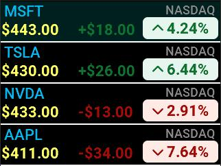

# Photo Album

This application displays basic information for multiple stocks with the following features:

- Stock Display Configuration: Users can configure settings to choose which stocks to display.
- Data Retrieval: Users must provide their own server API for stock data.
- Default Simulated Data: By default, the application simulates stock information for testing and display purposes.
- API Configuration: To set the server API, modify the `_STOCK_API_URL` variable in `service.py`.
- Disable Simulated Data: To stop using simulated stock information, change the `_USE_SIMULATED_DATA` variable in the same `service.py` file.

These features allow users to easily manage and display the stock information they need.

Discover more on the
[Mini Dock Developer Website](https://dock.myvobot.com/developer/).
