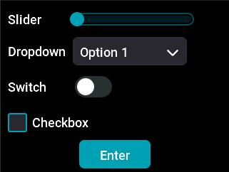

# Widgets Demo

This is a simple application that presents some basic controls of the LVGL graphics library on the screen and allows interaction with these controls using an encoder and buttons.

Discover more on the
[Mini Dock Developer Website](https://dock.myvobot.com/developer/).
